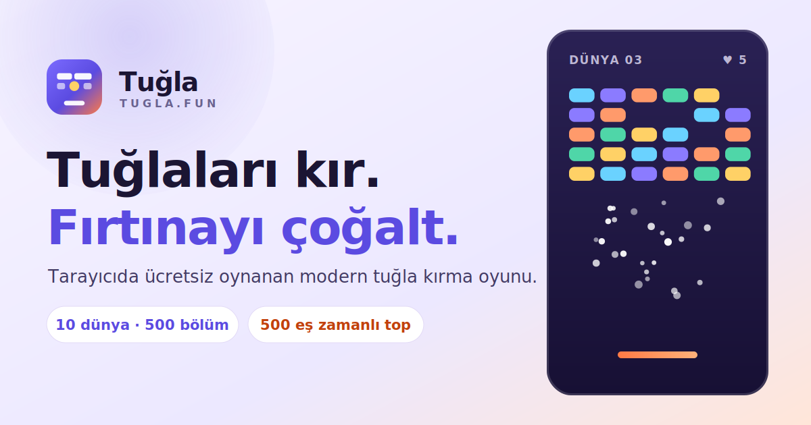
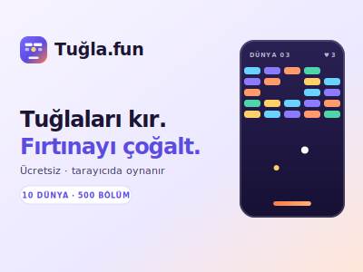
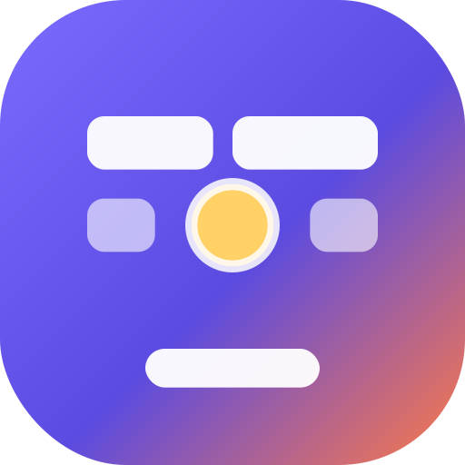

# Tuğla.fun

<p align="center">
  
</p>

<p align="center">
  
</p>

<p align="center">
  
  &nbsp;
  
</p>

<p align="center">
  <strong>10 dünya · 500 bölüm · 500 eş zamanlı top · 120 Hz deterministik fizik</strong><br>
  <a href="https://tugla.fun">tugla.fun</a> ·
  <a href="#lisans-ve-kaynak-bildirimi">MIT</a> ·
  <a href="SECURITY.md">Güvenlik politikası / Security policy</a>
</p>

> Arayüzün tamamını tarayıcıda görmek için `pnpm build:preview` çalıştırıp
> `preview/ui-preview.html` dosyasını aç: on ekran, gerçek derlenmiş CSS ile, TR/EN ve
> aydınlık/karanlık anahtarlarıyla.
>
> Run `pnpm build:preview` and open `preview/ui-preview.html` to see ten screens rendered with the
> real compiled stylesheets, with TR/EN and light/dark switches.

> Kod adı **Tuğla** — tüm marka/isim ayarları tek merkezden (`.env` + `pnpm rename-project`) değiştirilebilir.
> Codename **Tuğla** — every brand/name setting is driven from one place (`.env` + `pnpm rename-project`).

Modern, mobil öncelikli 2.5D brick-breaker: Three.js ile 3B görünüm, sabit 120 Hz deterministik 2D fizik,
sunucuda yeniden simülasyonla doğrulanan skorlar, 10 dünya / 500 bölüm, boss savaşları, günlük görevler,
haftalık ligler, sezonlar, topluluk bölüm editörü ve tam kapsamlı yönetim paneli.

---

## 🇹🇷 Türkçe

### Depo düzeni

| Yol                    | İçerik                                                              |
| ---------------------- | ------------------------------------------------------------------- |
| `apps/web`             | Oyuncu uygulaması (Next.js 15, PWA, Three.js sahnesi, TR/EN)        |
| `apps/admin`           | Yönetim paneli (Next.js 15, 15 modül + görsel bölüm editörü, TR/EN) |
| `apps/api`             | NestJS 11 API — auth, oyun, doğrulama, ilerleme, sosyal, admin      |
| `apps/mobile`          | Capacitor 7 kabuğu (Android/iOS; canlı PWA'yı yükler)               |
| `packages/game-engine` | Deterministik 2D fizik + replay (tarayıcı ve sunucuda aynı kod)     |
| `packages/shared`      | Zod şemaları, sabitler, checksum, tip sözleşmeleri                  |
| `packages/database`    | Prisma şeması, migration'lar, seed (500 bölüm dahil)                |
| `infrastructure/`      | Dockerfile'lar + Dokploy compose dosyaları                          |
| `scripts/`             | `rename-project`, `generate-secrets`, `e2e-api-smoke`               |

### Hızlı başlangıç (geliştirme)

Gereksinimler: Node 24+, pnpm 10+, PostgreSQL 16+, Redis 7+ (veya `docker compose up -d` ile yerel altyapı).

```bash
cp .env.example .env                 # sırları doldur: node scripts/generate-secrets.mjs
pnpm install
pnpm db:generate                     # Prisma client
pnpm build:packages                  # shared + game-engine + database dist
pnpm db:migrate                      # prisma migrate deploy
pnpm db:seed                         # 10 dünya / 500 bölüm + katalog + admin hesabı
pnpm --filter @tugla/api build && node apps/api/dist/main.js   # API :4000
pnpm --filter @tugla/web dev         # oyuncu uygulaması :3000
pnpm --filter @tugla/admin dev       # yönetim paneli :3001
```

Önemli: Build adımlarında `NODE_ENV` ayarlama — `next build` zaten `production` kullanır ve farklı
bir değer `/404` üretimini kırar (`scripts/assert-build-env.mjs` bunu erkenden ve anlaşılır biçimde
durdurur). Ayrıca `apps/*` paketleri `@tugla/*` paketlerini **derlenmiş `dist`** üzerinden tüketir; paketlerde
değişiklik yaptıysan `pnpm build:packages` çalıştır. API, NestJS decorator metadata gereksinimi nedeniyle
yalnızca `tsc` çıktısından (`apps/api/dist`) çalıştırılır.

### Oyuncu uygulaması ekranları

`/` açılış · `/auth/*` kayıt, giriş, doğrulama, parola sıfırlama · `/play` dünya + bölüm seçimi ve
oyun · `/progress` görevler, başarımlar, cüzdan defteri · `/leagues` haftalık lig ve küresel tablo ·
`/social` oyuncu arama, takip, arkadaşlık · `/create` **kendi bölümünü tasarla, test et, incelemeye
gönder; topluluk bölümlerini beğen/bildir** · `/shop` katalog ve oyun içi para ile satın alma ·
`/inbox` bildirimler + duyurular · `/replays` doğrulanmış tekrarlar ve paylaşım · `/account` profil,
dil, oturumlar, veri dışa aktarma, hesap silme. Tüm ekranlar aynı sekme şeridinden erişilebilir ve
oturum yoksa girişe yönlendirir (misafir hesap yoktur).

### Hesap açma ve Google ile giriş

E-posta ile kayıtta adrese **6 haneli doğrulama kodu** gönderilir (30 dakika geçerli). Kod tek
kullanımlıktır, adres başına deneme sınırı vardır ve 5 hatalı denemeden sonra kod yakılır — oyuncu
yeni kod ister. Aynı e-postadaki bağlantı kodu önceden doldurur, yani tek tıkla da doğrulanır.

Google ile kayıt/giriş tek düğmededir: tarayıcı Google Identity Services'ten imzalı bir kimlik
belirteci alır, API bunu Google'ın JWKS'ine karşı doğrular ve e-posta zaten kayıtlıysa hesabı
birleştirir. Düğme yalnızca `NEXT_PUBLIC_GOOGLE_CLIENT_ID` **ve** sunucudaki `GOOGLE_CLIENT_ID`
doluyken görünür; aksi halde arayüz sağlayıcının kapalı olduğunu dürüstçe söyler.

### Marka adı

Görünen ürün adı `APP_NAME` / `NEXT_PUBLIC_APP_NAME` ile gelir ve **Tuğla.fun**'dur; slug (`APP_SLUG`)
`tugla` olarak kalır çünkü paket adları, çerez öneki ve veritabanı kullanıcısı ondan türer. Bölüm
adları (`Tuğla 274`) bilinçli olarak kısa kalır: ürün adından bağımsızdır, seed içinde üretilir.

### Marka varlıkları ve paylaşım görseli

Logo ve tanıtım görselleri `apps/web/public/brand/` altındadır ve yayındayken doğrudan servis edilir:
`logo.svg`, `logo-512.png`, `logo-wordmark.svg|png`, `cover-400x300.svg|png` (+ `cover-800x600.png`),
`cover-1200x630.svg|png`, `cover-1280x720.svg|png`. Open Graph, Twitter kartı, PWA manifesti ve
JSON-LD bu dosyaları kullanır. Oyun listeleme siteleri için **4:3** görsel:
`https://tugla.fun/brand/cover-400x300.png`; sosyal paylaşım için
`https://tugla.fun/brand/cover-1200x630.png`; kare ikon için
`https://tugla.fun/brand/logo-512.png`.
Ayrıntı: `apps/web/public/brand/README.md`.

### Skor gönderimi ve boyut sınırı

Uzun bir oyun binlerce platform girdisi kaydeder. İki şey düzeltildi: tekrar kaydı artık aynı tik
içindeki girdileri üzerine yazıyor (aynı tikteki son girdi dışındakiler simülasyonu etkilemez), yani
paket boyutu cihazın işaretçi örnekleme hızıyla değil oyun uzunluğuyla orantılı; API gövde sınırı da
8 MB'a çıkarıldı. Önceden uzun oyunlar 413 ile reddediliyor, skor kayboluyordu.

Bölüm listesi, oyun bittikten sonra yeniden çekilir: kilit sunucuda açılıyordu ama oyuncunun
ekranındaki liste oyundan önce alınmış kopyaydı, bu yüzden yeni bölüm ancak sayfa yenilenince
açılmış görünüyordu.

### Skor doğrulama gerileme kaydı

Dürüst oyuncular bir süre `replay-score-mismatch` ile reddedildi. Sebep: platform hedefi tekrar
kaydında dört ondalıkla saklanıyor, canlı oyun ise tam çift duyarlıkla entegre ediyordu. Bu kadar
kaotik bir sistemde o küçük fark binlerce tikte tamamen farklı bir tahtaya dönüşüyor. Artık hedef
**uygulanmadan önce** yuvarlanıyor, yani canlı oyun ve doğrulama aynı sayıyı görüyor; ayrıca tekrar
istemcinin bildirdiği tikten ileriye simüle etmiyor. Beş bölümü gerçek kare süreleriyle oynayıp
sunucu gibi doğrulayan testler eklendi.

### Oynanış ve ilerleme

- **Dokunmatik:** Oyun alanı `touch-action: none` ile jesti üstlenir ve işaretçi olayları
  `preventDefault` eder. Bunlar olmadan tarayıcı dikey sürüklemeyi kaydırma sayıp işaretçi akışını
  iptal ediyordu; telefonda platformun hiç hareket etmemesinin sebebi buydu.
- **Süre:** HUD'daki kronometre `dakika:saniye:salise` biçiminde akar (`01:29:11`). Sayaç sabit
  120 Hz tikten türetilir — duvar saatinden değil — bu yüzden duraklatınca durur ve sunucunun
  doğruladığı süreyle birebir aynıdır. Salise hanesi kare hızında yazılır; HUD'ın geri kalanı
  saniyede on kez tazelenir, böylece kronometre akıcı görünürken gereksiz yeniden çizim olmaz.
- **Kontrol:** Platform artık parmağın/farenin tam altında. Ekran koordinatı, kameranın kadrajına
  ışın izlemeyle platform düzlemine yansıtılıyor; eskiden tuval genişliği doğrudan tahtaya
  eşlendiği için kadraj mektup kutusu olduğunda platform parmağın gerisinde kalıyordu. Bu hata
  üretime çıkabildi çünkü hesap WebGL gerektiren sınıfın içindeydi: artık saf bir fonksiyon
  (`projectPointerToBoardX`) ve dar telefon kadrajında gerilemeyi yakalayan testleri var.
- **Can:** Bölüm başına 3.
- **Top hızı sabit değil:** Dünya ilerledikçe artar, boss odalarında daha yüksektir ve her yedinci
  bölüm bir hız bölümüdür. Değer bölüm tanımından türetildiği için sunucunun doğrulama simülasyonu
  aynı hızı kullanır.
- **Bölüm kilidi:** Tüm bölümler listelenir, ancak bir bölüm ancak öncekini tamamlayınca açılır.
  Kilitli kart üzerinde kilit simgesi vardır, tamamlananda onay işareti. Kural sunucuda uygulanır:
  kilitli bir bölüm için oturum açma isteği reddedilir.
- **Bonuslar:** Havuz ağırlıklandırıldı; tek top yaygın, büyük sürüler nadir, faydalı bonuslar
  çoğunlukta. Yeni **güvenlik ağı** bonusu 5 saniye boyunca tabana ışıklı bir zemin serer: toplar
  düşmez, geri sekerler ve can gitmez.
- **Ses:** Bloğa çarpma, kırılmayan bloğa çarpma ve blok patlaması ayrı seslerdir; güvenlik ağı ve
  kalkan da kendi sesine sahiptir. Ses, oyun içi ayar panelinden açılıp kapatılır.
- **Görsel çeşitlilik:** Bölümler artık rastgele doldurulmuş tek bir dikdörtgen değil; 10 farklı
  siluet (duvar, tuğla örgüsü, piramit, elmas, sütunlar, kale, dalga, dama, kapı, halkalar)
  kampanyaya eşit dağıtıldı. Zor blok türleri siluetin kenarını ve üst sıraları izler, böylece
  zorluk gözle okunur. Her dünyanın kendi paleti (blok, zemin, ızgara, ışık) ve her bölümün kendi
  platform rengi vardır.

### Günün bölümü

Her UTC gününde yayınlanmış kampanya bölümlerinden biri **tarihin hash'iyle** seçilir: herkes aynı
bölümü oynar, hiçbir yerde takvim tutulmaz ve seçim destek için tekrar üretilebilir. `DAILY` modunda
gönderilen doğrulanmış skorlar `daily:<tarih>` tablosuna yazılır (günün en iyisi). Uç nokta herkese
açıktır: `GET /api/game/daily`.

Oynandığında **yalnızca o bölümün kilidi açılır**: oyuncu ona dönüp tekrar oynayabilir, ama
kampanyada **bir sonraki bölüm açılmaz** ve bölüm tamamlanmış sayılmaz. Kural sunucuda uygulanır;
ilerleme yalnızca `CAMPAIGN` modundaki tamamlanmış oturumlara bakar. Bölüm listesinde ✓ kampanyada
tamamlanmış, ★ günün bölümü olarak oynanmış demektir. Aynı gün tekrar oynamak için onay kutusunu
işaretlemek gerekir, çünkü bu oyun günlük tabloyu yalnızca daha iyi bir skorda günceller.

### Açılış sayfası

Üst çubuk artık yalnızca iki şey taşır: solda marka, sağda dil ve tema anahtarı. "Giriş yap" ve
"Kayıt ol" bağlantıları kaldırıldı çünkü **giriş formunun kendisi açılış sayfasında**: geri dönen bir
oyuncuyla oyun arasında fazladan bir sayfa yüklemesi yok. Zaten girişli bir ziyaretçi form yerine
"devam et" düğmesi görür. Kayıt kendi sayfasında kalır, çünkü daha fazla bilgi ister.

Düzen üç sütun: solda oyun animasyonu, **ortada** başlık ve tanıtım metni, sağda giriş formu. Dış iki
sütun aynı genişlikte (320 px), orta sütun biraz daha geniştir çünkü düzyazı forma göre daha çok
ölçü ister. Dar ekranda metin iki sütunun üstüne, telefonda ise sıralama belge sırasına döner:
metin, form, animasyon.

Başlık satır yüksekliği 1.32'dir. Daha düşük değerlerde ardışık satırların **seçim kutuları**
kesişiyor ve sayfa seçildiğinde metin üst üste binmiş gibi görünüyordu; Türkçe iniş harfleri (ğ, ç)
ve noktasız ı bunu belirginleştiriyor. Seçim rengi de markanın doygun mavisi yerine yumuşak tonuna
alındı, çünkü koyu zemin üzerinde vurguladığı metni okunmaz hâle getiriyordu.

Arka plandaki hareketli katman `.landing-backdrop` içinde ve `z-index: -1` ile durur; `.landing`
bilinçli olarak **saydamdır**, çünkü opak bir arka plan bu katmanın tam üzerine boyanır — animasyonun
görünmemesinin sebebi buydu.

Arka planda üç yavaş renk alanı gezinir; döngüler 44–60 saniye sürer, içeriğin üzerinden geçmez ve
`prefers-reduced-motion` açıkken tamamen durur — derinlik hissi verir, dikkat çalmaz.

Başlık satır yüksekliği 1.12'den 1.24'e çıkarıldı: Türkçe metinde `ğ` ve `ç` inişleri kırpılıyor ve
satırlar birbirine değiyordu.

### Analitik dağıtımı

Pano ayrı bir Dokploy uygulaması olarak çalışır; bu depodaki `analytics` servisi artık `analytics`
profili arkasındadır ve varsayılan olarak açılmaz. Dokploy'daki değişken adları, panonun okuduğu
adlarla birebir olmalıdır (`ANALYZE_*`, `ANALYTICS_*` değil) ve pano `standalone` derlendiği için
başlatma komutu `node .next/standalone/server.js` olmalıdır. Ayrıntı, Konferans'a özel parçaların
neden başka bir markanın panosunu etkilediği ve tugla.fun izleyicisinin nasıl bağlanacağı:
[`docs/ANALYTICS.md`](docs/ANALYTICS.md).

### Site analitiği

Ziyaretçi istatistikleri üçüncü taraf bir servisle değil, projenin kendi panosuyla toplanır —
**Analyze Your Site (Siteni Analiz Et)**:
[Analyze Your Site (Siteni Analiz Et)](https://github.com/emindemirciai/Analyze.Your.Site-Siteni-Analiz-Et-).
Depodaki `analytics` servisi (yalnızca `analytics` profiliyle açılır) bu depoyu `ANALYZE_REF`
sürümünden derler, olayları kendi biriminde JSON olarak
saklar ve yalnızca `WEB_URL` kaynağından olay kabul eder. Oyuncu uygulaması izleme betiğini
**yalnızca `NEXT_PUBLIC_ANALYZE_URL` doluysa** ekler; boşsa hiçbir sayfada hiçbir izleyici yoktur.
Yönetim panelindeki Analitik ekranı oyun verisini gösterir ve yapılandırılmışsa trafik panosuna
bağlantı verir. Ayrıntı: `docs/DEPLOYMENT.md`.

### Profil fotoğrafı

Oyuncu hesap ekranından **fotoğraf yükleyebilir**: PNG, JPEG veya WEBP, en fazla 2 MB. Görsel
tarayıcıda kare olacak şekilde ortadan kırpılır ve 256×256 boyutuna küçültülür — 6 MB'lık bir telefon
fotoğrafı yaklaşık 40 KB'a iner. Bu bir güvenlik önlemi değil, nezakettir: sunucu her şeyi yeniden
doğrular (bildirilen tür, dosyanın kendi imza baytlarıyla karşılaştırılır ve 2 MB tavanı uygulanır),
çünkü istemciden gelen hiçbir iddiaya güvenilmez.

Nesne depolama yapılandırılmışsa görsel kovaya yazılır; değilse kendi tablosunda tutulup API
üzerinden servis edilir. Her iki durumda da `avatarUrl` bir URL taşır, bu yüzden akışın geri kalanı
aynı kalır.

Fotoğraf yalnızca hesap ekranında değil, göründüğü her yerde: oyuncu başlığında, arkadaş listesinde,
arama sonuçlarında, lig tablolarında ve günün bölümü sıralamasında. Fotoğrafı olmayan oyuncu için baş
harfi gösterilir — yirmi satırlık bir listede yirmi özdeş siluet hiçbir bilgi taşımaz.

Kullanıcı modelinde iki alan var ve bu bilinçli: `providerAvatarUrl` sağlayıcının (Google) verdiği
fotoğraf, `avatarUrl` ise oyuncunun yüklediği. Google ile her girişte **yalnızca sağlayıcı alanı**
tazelenir; oyuncunun kendi seçimi asla üzerine yazılmaz — aksi hâlde her giriş, kişinin bilinçli
tercihini sessizce geri alırdı. Görüntülenen fotoğraf `avatarUrl ?? providerAvatarUrl` sırasıyla
çözülür; hesap ekranında hangisinin geçerli olduğu yazar ve "Google fotoğrafına dön" düğmesi kendi
seçimi temizler.

### Profil düzenleme ve ses

Hesap ekranı alan alan etiketli bir formdur: görünen ad, kullanıcı adı, e-posta ve parola. **Görünen
ad ve kullanıcı adı düzenlenebilir**; e-posta adresi değildir. Hesabın
sahibi olan adresi değiştirmek bir doğrulama akışıdır, profil düzenlemesi değil — bu yüzden e-posta
yalnızca durumuyla birlikte gösterilir ve doğrulanmamışsa oradan yeni kod istenebilir. Ad değişikliği
7 günde bir yapılabilir ve kullanıcı adı benzersizliği sunucuda kontrol edilir. Personel de yönetim
panelinden bir oyuncunun adını düzeltebilir; bu, oyuncunun kendi 7 günlük hakkını harcamaz ve audit
log'a `USER_PROFILE_EDIT` olarak yazılır.

Parola aynı ekrandan değiştirilir. Kaydedildiğinde diğer tüm cihazlardaki oturumlar sunucu tarafında
kapatılır ve bu, düğmenin altında yazılıdır — oyuncunun bunu telefonunda fark etmesi kötü bir sürpriz
olurdu.

**Ses:** Bölüm başında ses gelmiyordu. İki sebebi vardı: `AudioContext` askıya alınmış başlıyor ve
`resume()` eşzamansız, dolayısıyla ilk sesler henüz başlamamış bir saate göre planlanıyordu; ayrıca
hız sınırlayıcı ses saatini kullanıyordu ve askıdaki bağlamda o saat sıfırda donduğu için **her sesi**
eliyordu. Ses cihazı artık bölüme girildiği anda ve ilk dokunuş/tuşta açılıyor, hız sınırı ise duvar
saatiyle çalışıyor. Dört birim test bunu koruyor.

### Yönetim panelinde kayıt formları

Görevler, başarımlar, mağaza, sezonlar, duyurular ve feature flag ekranları artık JSON metin kutusu
yerine **alan alan form** kullanır: açılır listeler enum değerlerini gösterir (görev olayı, periyot,
nadirlik, para birimi), tarihler tarih seçicidir, ödüller para birimi başına sayı alanıdır ve
işaretlenebilir alanlar onay kutusudur. Tablodaki her satırın **Düzenle** düğmesi kaydı forma yükler;
aynı anahtarla kaydetmek onu günceller, yeni anahtar yeni kayıt açar.

JSON'un kaldığı tek yer **remote config**: içeriğini istemciler serbestçe okur, dolayısıyla sabit bir
alan listesi orada gerçeği yansıtmazdı. Sunucu doğrulaması değişmedi — aynı Zod şemaları çalışıyor,
form yalnızca girişi insana uygun hâle getiriyor.

### Yönetim panelinde gezinme

Kenar çubuğundaki her bağlantı, genel bakıştaki kartıyla **aynı simgeyi** taşır: iki ekran tek bir
görsel sözlük öğretir, iki ayrı değil. Sağ üstteki ortam rozeti kaldırıldı — personelin zaten bildiği
bir şeyi her ekranın köşesinden tekrar etmenin değeri yoktu.

### Oyuncu profili

Arama kimseyi bulmayı, arkadaşlık kimseyi eklemeyi sağlıyordu ama kimin kim olduğunu gösteren bir yer
yoktu. `/players/<kullanıcı-adı>` bunu gösterir: fotoğraf, oyuncu seviyesi, tamamlanan bölüm sayısı,
başarım sayısı, en iyi haftalık skor ve katılım tarihi — üstelik ekrandaki eylem duruma göre değişir
(ekle, isteğin beklemede, mesaj gönder ya da kendi profilinse düzenle).

Gizlilik burada da geçerli: aramada görünmemeyi seçen bir oyuncuya kullanıcı adı tahmin edilerek de
ulaşılamaz — uç nokta 404 döner.

### Mesajlaşma

Oyuncular **arkadaş oldukları** kişilere mesaj gönderebilir (`/social` ekranında her arkadaşın
yanındaki kutu). Personel de yönetim panelindeki kullanıcı listesinden bir oyuncuya mesaj
gönderebilir — eksik veya kural dışı bilgiyi düzeltmesini istemek için tek yol bir yasaklama olmasın
diye.

Mesajlar ayrı bir tablo yerine **bildirim kutusu** üzerinden taşınır: bir oyuncuya gelen mesaj zaten
onun gelen kutusundaki bir şeydir, böylece okundu durumu, listeleme ve hesap silindiğinde temizlenme
kendiliğinden çalışır.

**Gizlilik:** Yönetim panelindeki `Mesaj kayıtları` sekmesi yalnızca _kimin kime yazdığını_ gösterir
— "@ali kullanıcısı @veli kullanıcısına mesaj attı" — ve mesaj içeriği hiçbir yerde saklanmaz veya
görüntülenmez. Audit kaydı yalnızca karakter sayısını taşır. Moderasyonun ihtiyacı "kim kiminle
temas ediyor" sorusunun cevabıdır; özel mesajları okumak ayrı bir yetkidir ve bu ekran onu vermez.

### Sezonlar ve bildirimler

Sezonlar artık gerçekten kapanıyor: her saat çalışan görev, süresi dolan aktif sezonun
`season:<key>` tablosunu sıralar, sezonda tanımlı ödül basamaklarını (`top1`, `top10`, …) dağıtır,
kazananlara bildirim bırakır, sezonu pasifleştirir ve sırada bekleyen sezonu devreye alır. Tüm işlem
tek transaction içinde olduğu için bir sezon iki kez ödenemez; sonuç audit log'a `SEASON_SETTLED`
olarak yazılır.

Bildirim kutusu de artık gerçek olaylarla besleniyor: arkadaşlık isteği ve kabulü, topluluk
bölümünün yayınlanması/reddedilmesi/arşivlenmesi, çok bildirim sonrası otomatik incelemeye alınması
ve sezon sonucu. Daha önce moderasyon kararı yazara hiçbir şekilde bildirilmiyordu.

### Kapasite ve hız sınırı

`pnpm test:load` gerçek bir k6 senaryosudur: sağlık probu + dünya kataloğu + bölüm listesi +
kimlikli oturum başlatma (yineleme başına dört istek). Bu depoda ölçülen taban değerler (geliştirme
konteyneri, sınırlar yükseltilmiş): **78,6 istek/sn, 0 hata, p95 22 ms, p99 47 ms**. Ayrıntı ve
kurulum: `docs/OPERATIONS.md`.

API **istemci IP'si başına** hız sınırı uygular (`RATE_LIMIT_BURST` 30/sn, `RATE_LIMIT_SUSTAINED`
1200/dk; hepsi environment'tan ayarlanır). Mobil operatörler çok sayıda oyuncuyu tek adresin arkasına
koyduğu için varsayılanlar cömerttir. `GET /api/health` sınırdan muaftır: izleme, oyuncunun hakkını
yemez ve sınırlayıcı bir kesintiyi gizleyemez. Yük testi sınıra takılırsa betik ölçümü geçerli
saymaz ve `rate_limited_requests` eşiğiyle çalışmayı düşürür.

### Görünüm ve palet

Varsayılan tema **aydınlık**. Önceden cihaz tercihi izleniyordu; çoğu cihaz karanlık olduğu için
ziyaretçiler koyu menekşe bir sayfayla karşılaşıyor ve site kasvetli görünüyordu. Palet de tazelendi:
gün ışığı artık soğuk beyaz-mavi, birincil renk elektrik mavisi (`#2f6bff`), karanlık mod menekşe
değil arduvaz mavisi. Tema seçimi tek düğme — üstünde geçilecek modun simgesi (☀ / ☾) — ve tercih
hatırlanır. Üç seçenekli "Gündüz / Gece / Cihaz" kontrolü kaldırıldı.

### Tasarım sistemi — "gün ışığı arcade"

Arayüz tek bir jeton setinden beslenir (`apps/web/app/styles.css` ve `apps/admin/app/admin.css`
içindeki `:root`). Hiçbir bileşen kendi hex'ini yazmaz; renk değişimi tek yerden yapılır.

| Jeton                            | Değer                             | Kullanım                                     |
| -------------------------------- | --------------------------------- | -------------------------------------------- |
| `--paper`                        | `#f6f3ff`                         | Sayfa zemini (leylak kırığı gün ışığı)       |
| `--surface`                      | `#ffffff`                         | Kartlar, tablolar, paneller                  |
| `--ink` / `--ink-3`              | `#1b1533` / `#6a6390`             | Başlık ve ikincil metin                      |
| `--brand`                        | `#5b4be1`                         | Birincil eylem, aktif durum                  |
| `--coral`                        | `#ff7a45`                         | Enerji: platform, overcharge, boss rozeti    |
| `--mint` / `--amber` / `--rose`  | `#12b886` / `#f5a524` / `#e5484d` | Olumlu / uyarı / hata                        |
| `--stage-top` → `--stage-bottom` | `#2a2154` → `#171034`             | **Yalnızca oyun alanı**: aydınlatılmış sahne |

İki tema var: **Gündüz** (varsayılan), **Gece** ve **Cihaz** (sistem tercihini izler). Seçim hesap
ekranından ve oyun içi ayar panelinden yapılır, ilk boyamadan önce uygulanır (tema titremesi yok).
Gece modu siyah değil, oyun sahnesiyle aynı menekşe-erik tonlarını kullanır.

Ayrım bilinçli: **arayüz gün ışığı, oyun alanı sahne.** 3B blokların parlaması için koyu bir zemin
gerekir; menüler, hesap ekranı ve yönetim paneli için gerekmez. Her dünya kendi rengini taşır
(`--card-hue`), böylece bölüm seçimi tek renkli değil. Durum rozetleri "tugla chip": nefes alan bir
nokta + etiket. `prefers-reduced-motion` tüm animasyonları kapatır.

### Topluluk içeriği güvenliği

Oyuncu yapımı bölümler yayına girene kadar moderasyondan geçer ve yayına girdikten sonra da denetimsiz
kalmaz:

- Gönderim `DRAFT` → `REVIEW` akışıyla ilerler; yalnızca moderatör yayınlar.
- Yayınlanan bölümler beğeni/beğenmeme alır (kendi bölümünü değerlendiremezsin) ve liste beğeniye göre sıralanır.
- Aynı kişi bir bölümü yalnızca bir kez bildirebilir; **üç farklı oyuncu bildirdiğinde bölüm otomatik
  olarak yayından alınıp `REVIEW` durumuna döner** ve bu işlem audit log'a `LEVEL_AUTO_REVIEW` olarak yazılır.
- Oynanmış bir bölüm silinmez, arşivlenir: replay doğrulaması geçmişe dönük çalışmaya devam eder.

### Keşfedilebilirlik: SEO / GEO / AEO

Tüm değerler environment'tan gelir (`WEB_URL`, `APP_NAME`, `APP_TAGLINE`, `DEFAULT_LOCALE`,
`SEO_INDEXABLE`, `AI_CRAWLERS_ALLOWED`, `SOCIAL_TWITTER`, `GOOGLE_SITE_VERIFICATION`,
`BING_SITE_VERIFICATION`), yani alan adı ve marka değiştiğinde kod değişmez.

| Çıktı                | Adres                                           | Not                                                                                                                                                                                      |
| -------------------- | ----------------------------------------------- | ---------------------------------------------------------------------------------------------------------------------------------------------------------------------------------------- |
| robots.txt           | `/robots.txt`                                   | Oyuncu ekranları ve `/api/` kapalı; GPTBot, ClaudeBot, PerplexityBot, Google-Extended gibi yapay zekâ tarayıcılarına açık ya da kapalı olduğu **açıkça** yazılır (`AI_CRAWLERS_ALLOWED`) |
| Site haritası        | `/sitemap.xml`                                  | Yalnızca herkese açık sayfalar, her biri için `tr` + `en` alternatifleriyle                                                                                                              |
| llms.txt             | `/llms.txt`, `/llms.txt?lang=en`                | Yanıt motorları için kısa ve doğru özet + 6 SSS; uydurma bilgi yerine alıntılanabilir kaynak                                                                                             |
| Yapılandırılmış veri | Ana sayfa `<script type="application/ld+json">` | `@graph`: Organization, WebSite, VideoGame + SoftwareApplication, FAQPage                                                                                                                |
| OG görseli           | `/opengraph-image`                              | 1200×630 PNG, marka değerlerinden üretilir (yeniden adlandırmada yeni görsel gerekmez)                                                                                                   |
| PWA manifesti        | `/manifest.webmanifest`                         | `app/manifest.ts` ile environment'tan üretilir, kısayollar dahil                                                                                                                         |
| hreflang             | Her herkese açık sayfa                          | `?lang=tr` / `?lang=en` gerçekten o dili açar (`x-default` dahil)                                                                                                                        |

Gizlilik tarafı: `/play`, `/progress`, `/leagues`, `/social`, `/shop`, `/inbox`, `/replays`,
`/account` ve tüm token akışları `noindex, nofollow, nocache` döner; yönetim paneli tamamen kapalıdır
(`apps/admin/app/robots.ts`), API ise her yanıtta `X-Robots-Tag: noindex` gönderir.
Üretim dışı ortamlar `SEO_INDEXABLE=false` ile varsayılan olarak tamamen kapalıdır.

### Arayüz önizlemesi

```bash
pnpm build          # önce üretim derlemesi (CSS paketleri gerekli)
pnpm build:preview  # preview/ui-preview.html üretir
```

Tek dosyalık, bağımsız bir HTML çıkar: üretim derlemesinden alınan **gerçek CSS paketleriyle**
on ekranı (açılış, giriş, bölüm seçimi, oyun HUD'u, ilerleme, lig, mağaza, admin genel bakış,
admin kullanıcılar, SEO/GEO çıktıları) TR/EN anahtarıyla gösterir. İçindeki veriler örnektir; hiçbir API çağrısı yapmaz.

### Doğrulama kapısı

```bash
pnpm lint            # prettier --check + eslint (tek düz konfig)
pnpm typecheck       # tüm workspace
pnpm test            # 93 birim test (engine, shared, api, web, admin)
pnpm build           # packages + api + web + admin (production)
pnpm test:e2e:api    # 100 kontrollü uçtan uca API smoke (gerçek DB/Redis ister)
pnpm test:load       # k6 yük testi (k6 kurulumu gerekir; docs/OPERATIONS.md)
```

CI (`.github/workflows/ci.yml`) aynı kapıyı Postgres+Redis servisleriyle çalıştırır; `main`'e başarılı
push sonrası `deploy.yml` Dokploy webhook'unu tetikler.

### Skor doğrulama (hile önleme)

1. Oturum başlangıcında sunucu imzalı `seed + nonce` verir.
2. İstemci deterministik motoru bu seed ile çalıştırır; girdiler (tick + platform X) kaydedilir.
3. Bitişte istemci `skor + checksum + replay` gönderir; sunucu **aynı motoru aynı seed ile yeniden
   simüle eder**. Checksum/skor/istatistik uyuşmazsa oturum `REJECTED` olur, hiçbir tabloya yazılmaz ve
   moderasyon ekranına düşer. Süre, tick sayısı ve duvar saati de ayrıca sınırlanır.

### TR/EN yerelleştirme

- Oyuncu uygulaması: `apps/web/lib/i18n.tsx` (LocaleProvider + `useI18n`, sözlük eşliği birim testli).
- Yönetim paneli: `apps/admin/lib/i18n.ts` (modül seviyesinde `t()`, dil değişiminde yeniden yükleme).
- İşlemsel e-postalar: `apps/api/src/services/mail.ts` kullanıcının `locale` alanına göre TR/EN gönderir.

### Dokploy ile dağıtım (Hostinger KVM)

1. Sunucuya Dokploy kur, bu depoyu **private** olarak bağla.
2. "Docker Compose" uygulaması oluştur → dosya: `infrastructure/dokploy/compose.production.yml`.
3. `.env.example`'daki tüm değişkenleri Dokploy environment ekranına gir (sırlar dahil).
4. İlk dağıtım: `migrate` servisi `prisma migrate deploy` çalıştırır; ardından `api`, `web`, `admin`
   sağlık kontrolleriyle ayağa kalkar. Alan adları Dokploy/Traefik ekranından bağlanır; kod tarafında
   domain sabitlenmemiştir (`WEB_URL`, `ADMIN_URL`, `API_URL`).
5. GitHub otomatik dağıtımı için repo secrets: `DOKPLOY_PRODUCTION_WEBHOOK` (ve istenirse staging).

### Mobil (Capacitor)

```bash
cd apps/mobile
npx cap add android && npx cap add ios   # yerel projeleri bir geliştirici makinesinde üret
CAPACITOR_SERVER_URL=https://oyun.alanadi.com npx cap sync
npx cap open android   # / ios
```

Kabuk çevrim dışıyken `apps/mobile/www` açılış ekranını gösterir; bağlantı gelince canlı PWA yüklenir.

### İçerik tohumlaması dağıtımda otomatik

Bölüm tanımları veritabanında durur; bölüm üretimini değiştiren bir sürüm ancak yeniden tohumlama
sonrası görünür. `SEED_ON_DEPLOY=true` iken **API, dinlemeye başladıktan sonra** tohumlamayı kendisi
çalıştırır. Tohumlama upsert'tir: hesaplar, ilerleme, skorlar ve topluluk bölümleri korunur; yalnızca
üretilen kampanya içeriği ve katalog tazelenir. **Sürüm sonrası elle komut çalıştırmak gerekmez.**

Bu iş bilinçli olarak ayrı bir konteynerde değil: çıkış kodu üreten tek seferlik bir servis, dağıtım
hattı tarafından "başarısız sürüm" olarak okunabilir. Tohumlama servis ayağa kalktıktan sonra
başladığı için bir hata yalnızca loga yazılır, siteyi etkilemez.

Kampanya bölümlerini yönetim panelinden elle düzenliyorsan `SEED_ON_DEPLOY=false` yap. Elle
çalıştırma seçeneği duruyor: `docker compose --profile tools run --rm seed`.

### Çalışma zamanında pnpm ve corepack

API imajı, migration işini kendi içinde `pnpm --filter @tugla/database migrate` ile çalıştırır ve bu
komut ayrıcalıksız `api` kullanıcısıyla koşar. Corepack bu anda pnpm'i indirmeye kalkarsa — sahibi
olmadığı bir ev dizinine, dışa erişimi olmayabilecek bir sunucuda — iş düşer. Bu yüzden derleme
aşamasındaki corepack önbelleği runtime imajına kopyalanır, `COREPACK_HOME` her iki aşamada da
açıkça sabitlenir ve `/home/api` sahipliği API kullanıcısına verilir.

Açılıştaki içerik tohumlaması ise pnpm'e hiç uğramaz: doğrudan `node` ve node_modules içindeki `tsx`
ile çalışır. API konteyneri salt okunur olduğu için çalışma zamanında indirme veya yazma gerektiren
her adım gereksiz risktir.

### Dağıtım iş akışı ve "run failed" e-postaları

Depoda iki iş akışı var: **CI** (lint, typecheck, testler, smoke, derleme) ve **Dokploy deploy**.
İkincisi yalnızca `DOKPLOY_PRODUCTION_WEBHOOK` gizli değeri tanımlıysa bir şey yapar. Dokploy kendi
Git entegrasyonuyla dağıtıyorsa bu gizli değer gerekmez; iş akışı bunu bir hata olarak değil,
"yapılacak bir şey yok" olarak raporlar. Önceden gizli değer boş olduğunda iş kırmızıya düşüyor ve
her yeşil push'tan sonra "run failed" e-postası geliyordu.

Dependabot açtığı çekme istekleri için de CI koşar. Bu koşuların kırmızı olması bağımlılık
yükseltmesinin gerçekten kırıcı olduğunu gösterir — iş akışının hatası değildir; ilgili PR
incelenip kapatılmalı veya düzeltilmelidir.

### Dağıtım sorun giderme

`api-1 is unhealthy` ile düşen bir dağıtımın sebepleri ve çözümü `docs/DEPLOY-TROUBLESHOOTING.md`
dosyasındadır. Ortam hataları artık ölçülü: yalnızca bir özelliği kapatan ayarlar (posta ve depolama
sağlayıcı, varsayılan dil, SEO/tohumlama anahtarları) geçersizse uyarı yazılıp güvenli varsayılana
düşülür ve servis çalışır; enum hatalarında "bunu mu demek istediniz" önerisi verilir. Güvenliği veya
çalışabilirliği etkileyen değerler (veritabanı adresi, JWT sırları) hâlâ ölümcüldür. Kısaca: ortam doğrulaması başarısızsa API açılışta durur ve **hangi değişkenin neden**
reddedildiğini loga yazar (sırlar en az 32 karakter olmalı); veritabanına ulaşılamıyorsa sağlık ucu
artık **503** döner. Parola döndürdüysen PostgreSQL'in `POSTGRES_PASSWORD` değerini yalnızca ilk
kurulumda uyguladığını unutma — var olan bir birimde parola `ALTER USER` ile değiştirilir.

### Güvenlik olayı (2026-08-07) ve sertleştirme

Web konteynerinin loglarında uzaktan kod çalıştırma ve `/tmp` altına yük indirme izleri bulundu;
ayrıntı, kanıt ve sunucuda yapılması gerekenler `docs/INCIDENT-2026-08-07.md` dosyasındadır.
**Sırların tamamı yakılmış sayılmalı ve döndürülmelidir.** Depoda yapılanlar: Next.js 15.3.3 →
15.5.23 ve uygulama konteynerlerinin sertleştirilmesi — salt okunur dosya sistemi, tüm Linux
yeteneklerinin düşürülmesi, `no-new-privileges` ve `noexec` bir `/tmp` tmpfs'i. Bir sonraki açıkta
bile bir yük yazılamaz ve çalıştırılamaz.

### Lisans ve kaynak bildirimi

Depo **MIT lisanslıdır** (`LICENSE`). Servis edilen HTML'in başında, "kaynağı görüntüle" diyen
herkesin göreceği iki dilli bir bildirim vardır; tarayıcı konsoluna da aynı bilgi yazılır.
Sayfa ayrıca `<meta name="copyright">` ve `<meta name="license">` taşır. Hak sahibi `SITE_OWNER`
değişkeninden gelir.

**Dürüst uyarı:** İstemci kodu tarayıcıya gönderilir; teknik olarak gizlenemez. Küçültme ve
kaynak haritalarının kapalı olması okumayı zorlaştırır, engellemez. Sağ tık engellemek de koruma
sağlamaz, yalnızca kullanılabilirliği ve erişilebilirliği bozar — bu yüzden yapılmadı. Yapılan şey
dürüst olanı: kimin eseri olduğunu ve hangi şartlarla kullanılabileceğini açıkça belirtmek.

MIT'in anlamı: **herkes kodu kopyalayabilir, değiştirebilir ve kendi projesinde kullanabilir**;
tek şart telif ve lisans bildirimini korumaktır. Kodun kopyalanmasını istemiyorsan MIT yanlış
seçimdir; o durumda tescilli (proprietary) bir lisans metni gerekir. Marka adı, logo ve görseller
zaten MIT kapsamında değildir.

### İki dillilik nasıl güvence altında

TR ve EN desteği "yazıldı ve umulur ki çalışıyor" durumunda bırakılmadı; her commit'te testle
doğrulanır:

| Katman            | Kaynak                          | Test                                                                                                                        |
| ----------------- | ------------------------------- | --------------------------------------------------------------------------------------------------------------------------- |
| Oyuncu uygulaması | `apps/web/lib/i18n.tsx`         | anahtar eşliği, boş/TODO çeviri yok, `{değişken}` adları iki dilde aynı, son eklenen ekranların anahtarları dolu ve TR ≠ EN |
| Yönetim paneli    | `apps/admin/lib/i18n.ts`        | anahtar eşliği, boş çeviri yok, değişken eşliği                                                                             |
| İşlemsel e-posta  | `apps/api/src/services/mail.ts` | her mesaj iki dilde, tüm alanlar dolu, TR metni EN'in kopyası değil, doğrulama kodu etiketi mevcut                          |

Bir anahtar tek dilde kalırsa test kırılır; oyuncu ham anahtar görmez.

### Sürüm ve commit biçimi

Tek sürüm kaynağı kökteki `package.json` (`pnpm release:version 1.5.0` tüm paketleri günceller).
Commit başlıkları Türkçe ve şu biçimdedir:

```
feat: topluluk bölümleri — oyuncu editörü ve inceleme akışı (API, web, smoke) · v1.4
```

### Ajanlar için talimatlar (Antigravity, Cursor, Claude Code…)

Kurallar, komutlar, tuzaklar ve commit biçimi araç bağımsız **`AGENTS.md`** dosyasındadır;
`CLAUDE.md` yalnızca oraya işaret eder. Yeni bir ajanla çalışmaya başlarken tek okuması gereken dosya
budur.

### Depoyu uzak sunucuya bağlama

Depo temiz ve tüm işler commit'lenmiş halde teslim edilir; uzak depo bağlı değildir. Bağlamak ve
`main` dalını yüklemek için:

```bash
bash scripts/first-push.sh git@github.com:<owner>/<repo>.git
```

Betik çalışma ağacının temiz olduğunu doğrular, `origin`'i ekler/günceller ve force push yapmadan
gönderir. Ayrıca kökteki **`CLAUDE.md`**, Claude Code'un depoyu bağlam kaybı olmadan devralması için
komutları, tuzakları (API yalnızca `dist`'ten çalışır, `apps/api` içinde `import type` kullanılmaz)
ve TR/EN kuralını özetler.

### Proje adını değiştirme

```bash
pnpm rename-project "Yeni Ad" yeniad --dry-run   # önce ne değişeceğini gör
pnpm rename-project "Yeni Ad" yeniad             # uygula (temiz çalışma ağacı ister)
```

Paket adlarını (`@tugla/*`), görünen adı, slug'ı (veritabanı kullanıcısı, çerez öneki, depolama
anahtarları, Capacitor app id), Dockerfile'ları ve yedek betiklerini tek seferde günceller.
**Doğrulandı:** temiz bir kopyada 76 dosya değişti, geriye tek bir `tugla` izi kalmadı ve
`pnpm install` sorunsuz tamamlandı. Sonrasında: `pnpm install && pnpm db:generate && pnpm build`.

---

## 🇬🇧 English

### Repository layout

Same table as above: `apps/web` (player app), `apps/admin` (staff panel), `apps/api` (NestJS),
`apps/mobile` (Capacitor shell), `packages/game-engine` (deterministic physics + replay),
`packages/shared` (Zod contracts + checksum), `packages/database` (Prisma + seed),
`infrastructure/` (Docker + Dokploy), `scripts/` (rename, secrets, smoke).

### Quick start (development)

Requirements: Node 24+, pnpm 10+, PostgreSQL 16+, Redis 7+ (or `docker compose up -d`).

```bash
cp .env.example .env                 # fill secrets: node scripts/generate-secrets.mjs
pnpm install
pnpm db:generate
pnpm build:packages                  # apps consume @tugla/* from built dist
pnpm db:migrate && pnpm db:seed      # 10 worlds / 500 levels + catalogue + admin user
pnpm --filter @tugla/api build && node apps/api/dist/main.js
pnpm --filter @tugla/web dev         # :3000
pnpm --filter @tugla/admin dev       # :3001
```

The API must run from compiled output (`apps/api/dist`) because NestJS dependency injection relies on
emitted decorator metadata.

### Verification gate

`pnpm lint` · `pnpm typecheck` · `pnpm test` (93 unit tests) · `pnpm build` · `pnpm build:preview` ·
`pnpm test:e2e:api` (100-check end-to-end journey against a real database). CI runs the identical gate
with Postgres+Redis services and triggers the Dokploy webhook on success.

### Score verification (anti-cheat)

The server issues a signed seed+nonce per session; the client records inputs; on completion the server
**re-simulates the deterministic engine** with the submitted replay. Any checksum/score/stat mismatch
rejects the session (never touching leaderboards) and surfaces it in the moderation screen.

### Player screens & UI preview

`/` landing · `/auth/*` sign-up, sign-in, verification, password reset · `/play` world + level
selection and the game itself · `/progress` tasks, achievements, wallet ledger · `/leagues` weekly
league and global board · `/social` player search, follow, friendships · `/create` design, test and submit your own levels ·
`/shop` catalogue and
in-game-currency purchases · `/inbox` notifications + announcements · `/replays` verified replays and
sharing · `/account` profile, language, sessions, data export, deletion.

`pnpm build && pnpm build:preview` writes `preview/ui-preview.html`: a single self-contained file that
renders ten screens with the **real compiled CSS** from the production build and a TR/EN switch. The
data inside is sample data and no API calls are made.

### Sign-up and Google sign-in

Email sign-up sends a **six digit verification code** (valid 30 minutes, single use, attempt-limited;
five wrong guesses burn the code and the player requests a new one). The emailed link prefills the
code, so one click also works. Google sign-in/sign-up is one button: the browser obtains a signed ID
token from Google Identity Services, the API verifies it against Google's JWKS and merges the account
when the verified address already exists. The button only appears when both `NEXT_PUBLIC_GOOGLE_CLIENT_ID`
and the server-side `GOOGLE_CLIENT_ID` are configured.

### Brand assets

Logo and promotional artwork live in `apps/web/public/brand/` and are served straight from the site:
`logo.svg`, `logo-512.png`, `logo-wordmark.svg|png`, `cover-400x300.svg|png` (plus a 2× render),
`cover-1200x630.svg|png` and `cover-1280x720.svg|png`. Open Graph, the Twitter card, the PWA manifest
and the JSON-LD graph point at them. Game directories that ask for a 4:3 thumbnail can link
`https://tugla.fun/brand/cover-400x300.png` directly — it is a separate composition rather than a
downscale of the wide cover.

### Appearance

Light is the default. Following the device meant most visitors met a dark violet page, which read as
gloomy. The palette moved with it: daylight is now a cool blue-white with an electric blue accent
(`#2f6bff`), and dark mode is slate rather than plum. The three-way Day/Night/Device control is gone;
one button shows the mode it switches to (☀ / ☾) and the choice is remembered.

### Gameplay and progression

The paddle now sits exactly under the pointer (the screen position is ray-cast onto the paddle
plane instead of assuming the canvas equals the board). Lives are 3 per level. Ball speed is derived
from the level — rising per world, faster in boss rooms, with a sprint level every seventh — so the
server's verification run uses the identical value. Every level is listed but locked until the
previous one is cleared, enforced server-side. Boards are drawn from ten distinct silhouettes spread
evenly across the campaign, each world has its own palette and each level its own paddle colour.

### Landing page

The header carries only the brand on the left and the language and theme controls on the right. Sign
in and register links are gone because the sign-in form itself lives on the landing page; a visitor
who is already signed in sees a "continue" button instead. Three columns: the animation on the left, the headline and pitch in the middle,
the sign-in form on the right. The outer columns share one width; the middle is wider because prose
needs more measure than a form. Narrow screens put the pitch across the top, and a phone falls back
to document order. Headings use a 1.32 line-height: below roughly 1.3 the _selection_ boxes of consecutive lines
intersect, so selecting the page looked like overlapping text, and Turkish descenders make it worse.
The drifting layer lives in `.landing-backdrop` at `z-index: -1`, and `.landing`
is deliberately transparent — an opaque background there paints straight over it, which is why the
animation was invisible. Three slow colour fields drift behind the page (44–60s
cycles, never crossing the content, frozen under `prefers-reduced-motion`). Heading
line-height moved from 1.12 to 1.24 because Turkish descenders were clipped and lines touched.

### Site analytics

Traffic statistics come from the project's own dashboard —
[Analyze Your Site (Siteni Analiz Et)](https://github.com/emindemirciai/Analyze.Your.Site-Siteni-Analiz-Et-) —
rather than a third-party service. Variable names follow the dashboard's own `ANALYZE_*` prefix on
both sides. The `analytics` compose service builds it from a pinned ref, stores events as
JSON on its own volume and accepts events only from `WEB_URL`. The player app injects the tracker
**only** when `NEXT_PUBLIC_ANALYZE_URL` is set — otherwise no page carries any tracker at all.

### Profile picture

Players can **upload a picture**: PNG, JPEG or WEBP, up to 2 MB. The browser centre-crops it to a
square and resizes to 256×256, turning a 6 MB phone photo into roughly 40 KB. That is a courtesy, not
a safeguard — the server re-validates everything (declared type against the file's own magic bytes,
plus a hard 2 MB ceiling), because nothing a client claims can be trusted. With object storage
configured the image goes to the bucket; otherwise it is kept in its own table and served through the
API, and either way `avatarUrl` ends up holding a URL.

The picture appears wherever a player does: the hub header, friend lists, search results, league
tables and the daily board. Players without one get their initial rather than a silhouette, because
twenty identical placeholders carry no information.

Two columns, deliberately: `providerAvatarUrl` is what Google supplied and `avatarUrl` is what the
player uploaded. Signing in refreshes **only the provider column**, so a player's own picture is never
undone by their next Google sign-in. The displayed picture resolves as `avatarUrl ?? providerAvatarUrl`;
the account screen says which one is in use, and clearing the field returns to the provider picture.

### Profile editing and audio

The account screen is a labelled form: display name, username, email and password. Display name and
username are editable; the email address is not — changing the address that owns an
account is a verification flow, so it is shown with its state instead. Renames are limited to one per
week and usernames are checked for uniqueness server-side. Staff can correct a player's name from the
admin panel without spending that player's weekly change, recorded as `USER_PROFILE_EDIT`.

Audio was silent at the start of a level for two reasons: an `AudioContext` starts suspended and
`resume()` is asynchronous, so the first sounds were scheduled against a clock that had not started;
and the rate limiter used that same clock, which stays at zero while suspended, so it rejected every
sound. The device is now opened on entering a level and on the first input, and rate limiting runs on
the wall clock. Four unit tests pin the behaviour.

### Daily challenge

One published campaign level is picked per UTC day from a hash of the date, so everyone plays the
same level, no schedule is stored anywhere and the pick is reproducible for support. Verified runs in
`DAILY` mode land on the `daily:<date>` board (best score of the day). Public endpoint:
`GET /api/game/daily`.

Playing it unlocks **only that level** — the player can return and replay it — but it never opens the
next one and does not count as completed. The rule is enforced server-side: progression looks at
completed `CAMPAIGN` sessions only, while a `DAILY` session opens its own level and nothing else. In
the grid, ✓ means cleared in the campaign and ★ means played as the daily challenge.

### Admin record forms

Tasks, achievements, the shop, seasons, announcements and feature flags are edited through generated
forms instead of a JSON textarea: selects list the enum values (event type, cadence, rarity,
currency), dates use a picker, rewards are one number per currency, and booleans are checkboxes. Each
row has an **Edit** button that loads it into the form; saving with the same key updates it.

The one place JSON remains is remote config, where clients read whatever is stored, so a fixed set of
inputs would misrepresent it. Server-side validation is unchanged — the same Zod schemas run — the
form only makes the input humane.

### Admin navigation

Every sidebar link carries the same icon as its card on the overview, so the two screens teach one
visual vocabulary rather than two. The environment badge in the corner is gone: it repeated something
staff already knew, on every screen.

### Player profile

Search could find people and friendship could connect them, but nothing showed who they were.
`/players/<username>` does: picture, player level, levels cleared, achievements, best weekly score and
join date, with exactly the action that applies — add, pending, message, or edit when it is your own.
Privacy holds here too: a player who opted out of search cannot be reached by guessing their handle,
and the endpoint answers 404.

### Messaging

Players can message accepted friends from `/social`, and staff can message a player from the admin
user list — so asking someone to fix a display name does not require a ban. Messages travel through
the existing notification model rather than a new table: a message to a player _is_ something in
their inbox, so read state, listing and deletion with the account keep working unchanged.

Privacy is the point of the design. The admin **Message log** shows only who wrote to whom — "@a sent
a message to @b" — and the content is never stored or shown there; the audit entry carries a
character count and nothing else. Moderation needs to answer "who is contacting whom"; reading
private messages is a separate power and this screen does not grant it.

### Seasons and notifications

Seasons now actually close: an hourly job ranks the `season:<key>` board of any expired active
season, pays the reward tiers declared on it, notifies the winners, deactivates it and activates the
next scheduled season — all in one transaction, recorded as `SEASON_SETTLED` in the audit log. The
inbox is fed by real events too: friend requests and acceptances, community level published /
rejected / archived / auto-hidden, and season results. Previously a moderation decision never
reached the author.

### pnpm and corepack at runtime

The API image runs migrations with `pnpm --filter @tugla/database migrate` as the unprivileged `api`
user. If corepack has to fetch pnpm at that moment — into a home directory it does not own, possibly
on a host without outbound access — the job fails, so the build stage's corepack cache is copied into
the runtime image, `COREPACK_HOME` is pinned explicitly in both stages, and `/home/api` is owned by
the API user. Boot-time content seeding avoids pnpm entirely and runs through `node` with `tsx` from
`node_modules`, because the API container is read-only and anything that downloads or writes at
runtime is avoidable risk.

### Deploy workflow and "run failed" emails

There are two workflows: **CI** (lint, typecheck, tests, smoke, build) and **Dokploy deploy**. The
second one only acts when `DOKPLOY_PRODUCTION_WEBHOOK` is set. If Dokploy deploys through its own
Git integration, that secret is unnecessary and the workflow now reports "nothing to do" instead of
failing — previously it turned red after every green push and sent a "run failed" email.

CI also runs for Dependabot pull requests. A red run there means the dependency bump genuinely
breaks the build; review or close that PR rather than the workflow.

### Deployment troubleshooting

`docs/DEPLOY-TROUBLESHOOTING.md` covers why a deploy fails with `api-1 is unhealthy`. Environment
errors are now proportionate: a setting that merely disables a feature (mail or storage provider,
default locale, SEO and seeding switches) falls back to its safe default with a warning — including a
"did you mean" hint for enum typos — while values that affect safety or the ability to serve stay
fatal. The two classic causes are: an
invalid environment (the API stops at boot and names the offending variable; secrets need 32+
characters) or an unreachable database (the health endpoint now answers **503**, so "healthy" means
the service can actually serve). After rotating a database password, remember PostgreSQL only applies
`POSTGRES_PASSWORD` when the data directory is created — change it with `ALTER USER` on an existing
volume.

### Security incident (2026-08-07) and hardening

The web container's logs show remote code execution and a payload download into `/tmp`; the
evidence and the required server-side response are in `docs/INCIDENT-2026-08-07.md`. **Every secret
must be treated as burned and rotated.** In this repository: Next.js 15.3.3 → 15.5.23, and the
application containers now run read-only with all Linux capabilities dropped, `no-new-privileges`,
and a small `noexec` `/tmp` tmpfs, so the next bug cannot be turned into a running payload.

### Licence and source notice

The repository is **MIT licensed** (`LICENSE`). The served HTML opens with a bilingual notice that
anyone choosing "view source" will read, the same text is printed to the browser console, and the
page carries `copyright` and `license` meta tags. The rights holder comes from `SITE_OWNER`.

An honest caveat: client code is shipped to the browser and cannot be hidden. Minification and
disabled source maps make it harder to read, not impossible, and blocking right-click protects
nothing while harming usability — so it was not done. MIT also means anyone may copy and reuse the
code as long as the notice is kept; if that is not the intent, a proprietary licence is the correct
tool. Brand name, logo and artwork are outside the licence either way.

### How bilingual support is guaranteed

TR/EN is not left to hope: every commit runs parity tests. The player app
(`apps/web/lib/i18n.tsx`), the control centre (`apps/admin/lib/i18n.ts`) and transactional mail
(`apps/api/src/services/mail.ts`) are each checked for identical key sets, no empty or TODO strings,
identical `{variable}` names across languages, and — for mail and recent screens — that the Turkish
text is an actual translation rather than a copy of the English. A key that exists in one language
only fails the build, so a player can never see a raw key.

### Capacity and rate limiting

`pnpm test:load` runs a real k6 scenario (health probe, world catalogue, level list and an
authenticated session start per iteration). Baseline measured in this repository with limits raised:
**78.6 req/s, zero failures, p95 22 ms, p99 47 ms** — see `docs/OPERATIONS.md` for the k6 install and
the full table. Throttling is **per client IP** and fully env-driven (`RATE_LIMIT_BURST` 30/s,
`RATE_LIMIT_SUSTAINED` 1200/min); `GET /api/health` is exempt so monitoring never eats a player's
budget. A limiter-bound load run fails its own threshold instead of pretending to be a capacity
result.

### Design system — "daylight arcade"

One token set drives both apps (`:root` in `apps/web/app/styles.css` and `apps/admin/app/admin.css`);
no component hardcodes a colour. Paper `#f6f3ff`, ink `#1b1533`, one electric indigo `#5b4be1` for
action and a coral `#ff7a45` for energy, with mint/amber/rose for state. The playfield keeps a lit
violet stage (`#2a2154` → `#171034`) because 3D blocks need a dark room — the rest of the product
does not. Each world carries its own hue, status badges are "tugla chips" with a breathing dot, and
`prefers-reduced-motion` disables every animation. Three appearances ship — Day, Night and Device
(follows the system) — chosen from the account screen or the in-game settings panel and applied
before first paint, so there is no theme flash. Night is plum, not black.

### Community safety

Player-made levels go through moderation before publication and stay supervised afterwards: ratings
(never on your own level), one report per person per level, and **three distinct reports pull a
published level back into `REVIEW` automatically**, recorded in the audit log as `LEVEL_AUTO_REVIEW`.
Levels that have already been played are archived rather than deleted so replay verification keeps
working.

### Discoverability: SEO / GEO / AEO

Everything is environment-driven (`WEB_URL`, `APP_NAME`, `APP_TAGLINE`, `DEFAULT_LOCALE`,
`SEO_INDEXABLE`, `AI_CRAWLERS_ALLOWED`, `SOCIAL_TWITTER`, verification tokens), so a new domain or
brand needs no code change.

- `/robots.txt` — player screens and `/api/` disallowed; AI crawlers (GPTBot, ClaudeBot,
  PerplexityBot, Google-Extended, Applebot-Extended…) answered **explicitly**, allowed or blocked via
  `AI_CRAWLERS_ALLOWED`.
- `/sitemap.xml` — public routes only, each declaring `tr` and `en` alternates.
- `/llms.txt` (and `?lang=en`) — a short, accurate summary plus six FAQ entries so answer engines
  quote real copy instead of guessing.
- JSON-LD `@graph` on the home page — Organization, WebSite, VideoGame + SoftwareApplication, FAQPage.
- `/opengraph-image` — 1200×630 PNG generated from the brand values.
- `/manifest.webmanifest` — generated by `app/manifest.ts`, including app shortcuts.
- hreflang on every public page; `?lang=tr` / `?lang=en` genuinely switch the language.

Private screens and every token flow return `noindex, nofollow, nocache`; the admin panel is fully
disallowed and the API sends `X-Robots-Tag: noindex`. Non-production environments stay unindexed
unless `SEO_INDEXABLE=true`.

### Localisation

Player app: `apps/web/lib/i18n.tsx` (provider + hook, dictionary parity unit-tested). Admin panel:
`apps/admin/lib/i18n.ts` (module-level `t()`, reload on switch). Transactional email follows each
user's stored `locale` (TR/EN).

### Deploying with Dokploy

Create a Docker-Compose app pointing at `infrastructure/dokploy/compose.production.yml`, paste the
variables from `.env.example`, deploy (the `migrate` service runs `prisma migrate deploy` first), then
attach domains in Traefik — nothing in the code hard-codes a domain. Add the
`DOKPLOY_PRODUCTION_WEBHOOK` repo secret for push-to-deploy.

### Handoff & renaming

The repo ships clean and fully committed with no remote. Connect and push with
`bash scripts/first-push.sh <remote-url>` (clean-tree check, no force push). **`CLAUDE.md`** captures
the commands, gotchas and rules for Claude Code.

`pnpm rename-project "New Name" newslug` rebrands everything in one command (`--dry-run` first);
verified on a pristine copy: 76 files rewritten, zero leftovers, `pnpm install` still succeeds.

### Mobile

`npx cap add android && npx cap add ios` on a dev machine, then `npx cap sync` with
`CAPACITOR_SERVER_URL` set. Rename everything with `pnpm rename-project -- --name "NewName" --slug newname`.
